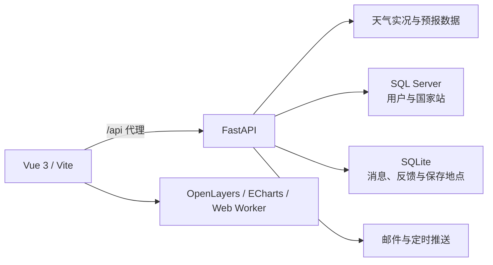

# 山东省天气实况与预报可视化系统

一个面向山东省的移动优先天气 WebGIS 平台。系统以 Vue 3 构建交互界面，以 FastAPI 提供天气、用户与推送服务，并通过 SQL Server 和 SQLite 保存账号、国家站、反馈、消息及个人地点等数据。

项目已经覆盖“观测—分析—预报—预警—通知—管理”的完整使用流程，适合作为 WebGIS、气象信息可视化和前后端综合课程设计成果。

## 已实现功能

### 山东天气实况

- 接入山东省 16 个地级市的 146 个国家气象站，先选地级市、再选国家站。
- 首页、实况页和预报页共享当前国家站，切换页面不会丢失选择。
- 展示气温、相对湿度、气压、风向、风速、能见度和降水等实时观测及 24 小时趋势。
- 首页和实况页提供天气雷达地图、山东省矢量轮廓、站点显隐开关与用户位置蓝点。
- 对全省站点观测进行空间插值，绘制实时气温、相对湿度、1 小时/24 小时降水、24 小时变温和变压色斑图；计算放入 Web Worker，避免阻塞页面交互。
- 按所选地点展示济南或淄博实况产品，支持降水、气温、风、能见度等分类及时段切换。

### 天气预报与个性化地点

- 提供未来 2 小时、24 小时和 7 天预报。
- 登录用户可保存最多 5 个山东省内地点，在首页快速切换。
- 保存地点时同步记录地址、经纬度及最近国家气象站。
- 首页展示天气预警，并支持消息中心的消息展开、收起和一键已读。

### 主动天气服务

- 根据雷达回波移动趋势判断用户是否即将进入降水区域；用户登录时若尚未开始下雨，可推送临近降雨提醒。
- 早间、午间和晚间天气报告可分别启停并自定义发送时间，时间范围分别为 05:00–11:00、11:00–16:30、16:30–22:30。
- 天气报告与临近降雨提醒可进入站内消息中心；绑定邮箱并开启推送后同步发送邮件。
- 使用 Gmail SMTP 发信，收件地址支持 Gmail、QQ、126、163 等常见邮箱。

### 用户、反馈与管理

- 支持注册、登录、JWT 身份认证、手机号和邮箱绑定、密码修改、位置与推送设置。
- 用户可提交意见反馈，并在管理员回复后查看处理结果。
- 管理员可查看反馈、填写回复及修改处理状态。
- 管理员可查看用户列表；列表默认只显示“昵称、编号、状态”，展开后查看账号资料和该用户保存的地点。
- 管理员可封禁或解封普通账号；被封禁账号无法登录，已有令牌也会被拒绝。
- 管理员可维护国家站和微信公众号文章。

### 体验与性能

- 移动端优先布局，同时适配桌面浏览器。
- 路由按需加载，天气请求带缓存和并发复用，页面切换包含竞态保护。
- 插值计算在 Worker 中执行，地图图层按需更新。
- 内置结合当前站点、预报和雷达信息的流式天气助手。

## 系统结构



### 技术栈

| 层级 | 技术 |
| --- | --- |
| 前端 | Vue 3、Vite、Vue Router、Axios |
| 地图与图表 | OpenLayers、ECharts、GeoJSON、Web Worker |
| 后端 | Python、FastAPI、Uvicorn、Pydantic |
| 数据 | SQL Server、SQLite、pyodbc |
| 安全 | JWT、bcrypt、管理员角色校验 |
| 通知 | 站内消息、定时任务、Gmail SMTP |

## 目录说明

```text
jinan-weather/
├─ src/
│  ├─ api/                 # 前端请求与缓存
│  ├─ components/          # 地图、消息、实况产品、管理组件
│  ├─ data/                # 山东边界与地级市—国家站关系
│  ├─ map/                 # 插值、图层和 Web Worker
│  ├─ views/               # 首页、实况、预报、我的等页面
│  └─ backend/             # FastAPI 服务、定时推送与测试
├─ DAILY_BRIEFING.md       # 天气报告与邮件配置说明
├─ WEATHER_MAP.md          # 实况地图实现说明
├─ vite.config.js
└─ package.json
```

## 本机运行

首次使用前安装前端依赖，并在 `src/backend/venv` 中准备 Python 依赖。数据库、邮箱、天气数据源等敏感配置放在项目根目录 `.env`；该文件已被 Git 忽略，请勿提交密钥或密码。

打开第一个 PowerShell 终端，在项目根目录启动后端：

```powershell
cd D:\WebGIS实习\jinan-weather
.\src\backend\venv\Scripts\Activate.ps1
python -m uvicorn main:app --app-dir src\backend --reload --host 0.0.0.0 --port 8000
```

打开第二个 PowerShell 终端启动前端：

```powershell
cd D:\WebGIS实习\jinan-weather
npm run dev
```

本机访问 `http://localhost:5173`，FastAPI 接口文档位于 `http://127.0.0.1:8000/docs`。

## 让同一局域网的小组成员访问

电脑与手机需要连接同一个 Wi-Fi 或局域网，并保持电脑开机、前后端终端持续运行。

后端仍使用上面的启动命令。第二个终端改为：

```powershell
cd D:\WebGIS实习\jinan-weather
npm run dev:lan
```

查询电脑的局域网 IPv4 地址：

```powershell
ipconfig
```

找到当前无线网卡或以太网适配器的“IPv4 地址”，例如 `192.168.1.23`。小组成员在浏览器打开：

```text
http://192.168.1.23:5173
```

请将示例 IP 替换为你的实际 IPv4 地址，不要在其他设备上填写 `localhost`。Windows 首次询问网络访问权限时，允许 Node.js 和 Python 通过“专用网络”防火墙。

## 测试与构建

```powershell
# 前端单元测试
node --test src\api\requestCache.test.js src\data\groundProducts.test.js src\data\stationCities.test.js src\map\weatherInterpolation.test.js

# 后端回归测试
.\src\backend\venv\Scripts\python.exe -m unittest discover -s src\backend -p "test_*.py"

# 生产构建
npm run build
```

## 课程答辩 / PPT 展示建议

推荐按照以下顺序演示，能清楚体现项目从数据到服务的完整链路：

1. 在首页切换保存地点，展示定位、预警和当前国家站联动。
2. 在实况页按地级市选择国家站，展示观测曲线与济南/淄博实况产品。
3. 在地图切换气温、湿度、降水、变温和变压插值图层，并演示站点显隐。
4. 展示预报页、消息中心和临近降雨提醒。
5. 展示早/午/晚天气报告的开关、时间范围及邮件推送。
6. 用管理员账号展开用户资料与保存地点，演示反馈回复和账号封禁。

可重点概括四个亮点：**全省 146 站空间组织、气象要素插值可视化、基于位置的主动降雨提醒、用户端与管理端闭环**。

## 安全说明

- `.env`、数据库文件、邮箱授权码和第三方 API 密钥不得上传到仓库。
- 用户与管理员接口均在后端校验身份和角色，不能只依赖前端页面隐藏。
- 邮件发送使用邮箱授权码，不应保存或展示邮箱登录密码。

## 项目信息

**山东省天气实况与预报可视化系统**

WebGIS Course Design
